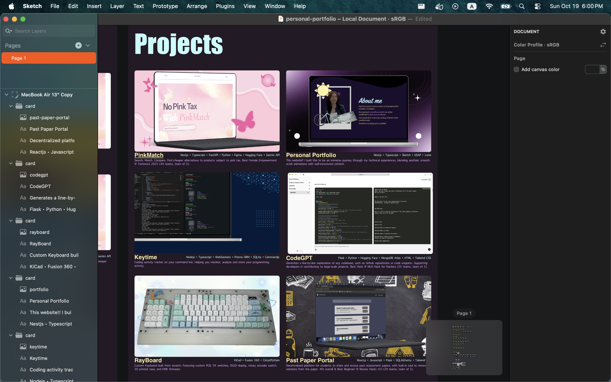

# Design log

This is a documentation of my process in designing my personal website using Sketch!! Hours spent designing and coding were both logged using Hackatime under the name "personal-portfolio". This log only provides a breakdown of design time.

### 17th Oct 2025
This is my first time using Sketch, so I experimented with its various features, and got started with designing the hero of my website. Spent a lot of time trying out different fonts to figure out which design looks best.
###### Time spent: ~45 min

I started sketching out frames for the hero section animation. Since new text would be animated into the hero, I also experimented with the fonts of those text. The goal was to make them look cohesive with the rest of the section but also maintain there own unique style.
###### Time spent: ~30 min

Starting having doubt about whether my current design was animating too much and make the experience too complex. Tried out some new hero designs to make better use of screen space.
###### Time spent: ~25 min

I liked the new design, so I made more versions of the design concept, and started sketching out the animation frames for the design. I made animation frames for 2 versions of the design and prototyped interactions between pages to get a sense of which would provide a better user experience.
###### Time spent: ~25 min

Moved on to the next section - about me!! I wanted to make a wave-like curve shape to separate the hero section from the about me, so at first I tried to make that element using the vector command in Sketch, but I couldn't get it to look right. I ended up installing Inkscape and making the shape there instead. Then I just drafted up my about me pargraphs and compared some fonts!!
###### Time spent: ~70 min

Created a photoframe and arranged a bunch of elements trying to figure out which design would look best. 
###### Time spent: ~45 min

Started working on the experience section!! Designed the title and timeline, and then started playing with different fonts for the experience title.
###### Time spent: ~45 min

Finalized the design for each experience card and finshed the experience section!
###### Time spent: ~30 min

### 19th Oct 2025

Started working on the project section!! I have been ideating the design and arragement of the info cards. Also, I decided to change the experience section a bit. Instead of having the title at the top, the title will expand and then disappear on scroll. At the top of the experience page will now be a little paragraph about the work I do, and some links to my socials!! I think that'll be a little more interesting to users.
###### Time spent: ~70 min

I first created some sample project cards with borders, but then I realized that borders were horribly generic and so I created a version without borders. Then I experimented with different fonts and characters for the different components of the project card, as well as compared different card designs.
###### Time spent: ~70 min

Finished project section!! Wrote descriptions for all 6 project that I want to include, and created mockups for each of my projects to showcase. Took me a while to figure out how much depth I want to include in the description.
###### Time spent: ~60 min

Contacts section and footer complete!! Made a whole bunch of designs trying to balance aesthetics and purpose. Also made some small tweakes to the project section to improve spacing between project cards.
###### Time spent: ~50 min

### 20th Oct 2025

Made some small adjustments to the the footer and experiences page. I also experimented with various background shadows to find the best on-hover effect for the project cards, since I decided that I didnt want to use borders.
###### Time spent: ~30 min

Decided that I didn't like the current font of the role section of the experience cards, so I experimented with some different fonts to find a better option.
###### Time spent: ~15 min

When reviewing the design, I noticed that in the project cards, the font of the description was too small, and the color was too similar to the background, making the hard to read. I therefore tested out new text colors and sizes to find something that works better, and then changed all the project cards with the new design.
###### Time spent: ~30 min

I did not realize that the several fonts that I was using in my design couldn't be imported into my project repo because they are not availble for free, so I had to look for different fonts and change the font styles across my website design. Because the fonts of different part of the section had to look cohesive together, I also ended up changing the font styles in some another parts of the design as well. I imported and tested many font options before finalizing on my new set of font.
###### Time spent: ~45 min

1 12
1 15